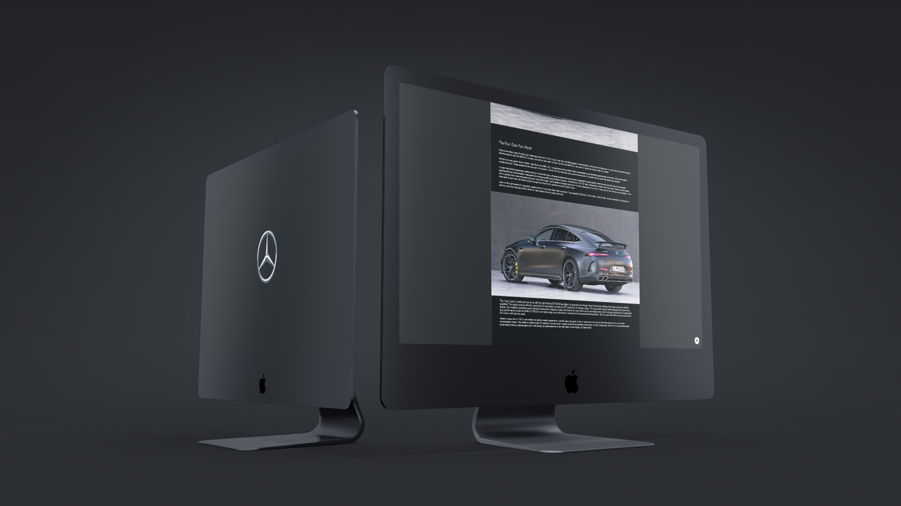

<h1>Mercedes-AMG GT 63 S Page</h1>

  

<h2 align="center">
  Acesse a página da AMG GT 63 S<a target="_blank" href="#">AQUI</a>!
</h2>

  <a href="#clipboard-sobre-o-projeto">Sobre o Projeto</a>&nbsp;&nbsp;&nbsp;|&nbsp;&nbsp;&nbsp;
  <a href="#computer-tecnologias-utilizadas">Tecnologias</a>

## :clipboard: Sobre o Projeto
Essa página review do carro Mercedes Benz AMG GT 63 S, foi desenvolvida com os conhecimentos que possuo em HTML, CSS e JS.

## :computer: Tecnologias utilizadas

O projeto foi desenvolvido utilizando as seguintes tecnologias:

- HTML
- CSS
- JavaScript
